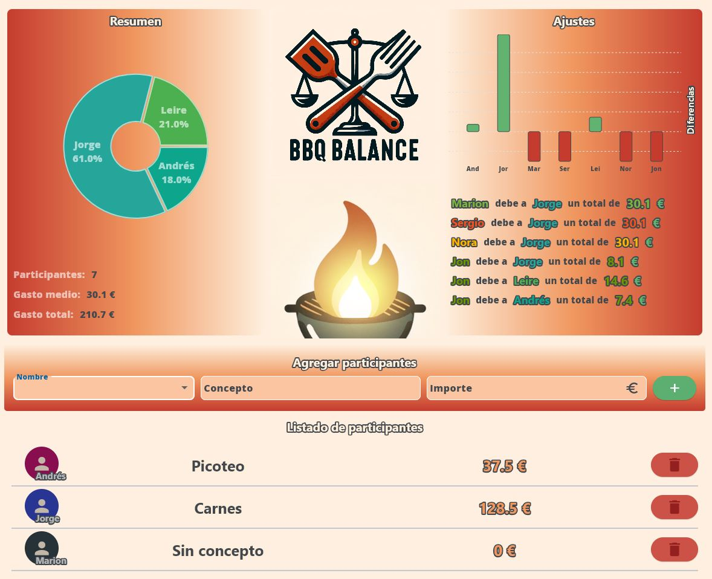
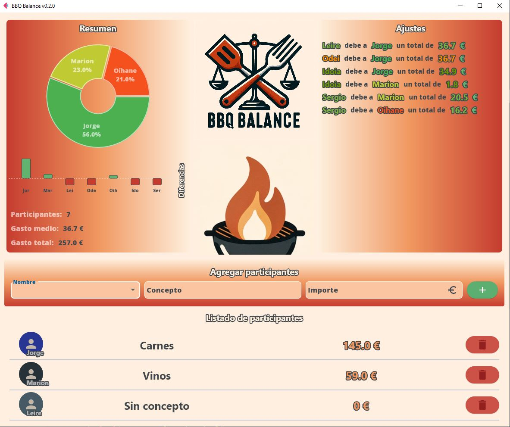

# BBQ BALANCE v 0.2.0
# 🍔🌭🍗🍖🍺🌽🍉🍴🔥👨‍👩‍👧‍👦
## Aplicación tipo splitwise para equilibrar las cuentas cuando hagamos barbacoa en el grupo de padres del parque.
Aplicación sencilla de una sola página con gráficos interactivos

## Para la UI
1. Flet


## Familias
- Andrés y Marta
- Estela y Odei
- Leire y Sergio
- Naiara y Jorge
- Nora y Jon
- Marion y Olivier
- Idoia y Eneko

## APP


## Uso
Simplemente añade participantes a la barbacoa y si han hecho un gasto, rellena el apartado concepto e importe.

## Updates
- 29/02/2024 - v0.2.0 
    
    - Añadidos Bruno y Oihane a la lista de la aplicación. Cambiado el layout manteniendo a mano derecha solo los ajustes.
    - Se añade la versión de la app en el título, vinculada al archivo pyproject.toml
    - 
    - Para upgradear versión menor:
    
    ```sh
    poetry version minor
    ```
    - Se actualiza la versión de Flet a la 0.21.2
    
- 30/03/2024 - v0.2.1

    - Se actualiza el código siguiendo las actualizaciones de Flet. Se cambian los métodos update_async y add_async
     por update y add respectivamente

## Mejoras a implementar
- Meter una capa nueva de algortimo para priorizar el pago entre parejas
- Meter opción de realizar un informe y enviarlo por mail a cada participante de la barbacoa